# Pipeline Architecture Diagram

## Data Flow Diagram: Pipeline → Bridge → DataLoader → Model

This is a **data flow diagram** showing how data moves through the pipeline from raw scene metadata to trained model outputs. Visual distinctions:
- **Rectangular boxes** = Processing components (stages, transformers)
- **Cylindrical shapes** = Data structures (dataclasses, DTOs)
- **Thick arrows** = Primary data flow
- **Dashed arrows** = Control flow or problematic connections

```mermaid
graph TB
    %% ============================================
    %% LEGEND - Dark theme friendly colors
    %% ============================================
    subgraph Legend["Visual Legend"]
        direction LR
        COMP[Processing Component]
        DATA[(Data Structure)]
        OK_LEG[Working]
        WARN_LEG[Warning]
        ERROR_LEG[Error]
        LOCATION_LEG[Location Issue]
    end
    
    style COMP fill:#2d5016,stroke:#4a7c2c,stroke-width:3px,color:#e0e0e0
    style DATA fill:#1a3d5c,stroke:#2e5c8a,stroke-width:3px,color:#e0e0e0
    style OK_LEG fill:#2d5016,stroke:#4a7c2c,stroke-width:3px,color:#e0e0e0
    style WARN_LEG fill:#6b5416,stroke:#8b6914,stroke-width:3px,color:#e0e0e0
    style ERROR_LEG fill:#6b1a1a,stroke:#8b1a1a,stroke-width:3px,color:#e0e0e0
    style LOCATION_LEG fill:#1e4d7b,stroke:#2e5c8a,stroke-width:3px,color:#e0e0e0

    %% ============================================
    %% ASYNC PIPELINE STAGES (Processing Components)
    %% ============================================
    subgraph AsyncPipeline["ASYNC PIPELINE src/rawnind/dataset/"]
        direction TB
        
        Ingestor[DataIngestor<br/>Stage 1: Ingestion]
        Scanner[FileScanner<br/>Stage 2: File Checking]
        Downloader[Downloader<br/>Stage 3: Download Missing]
        Verifier[Verifier<br/>Stage 4: Hash Validation]
        Indexer[SceneIndexer<br/>Stage 5: Scene Grouping]
        Enricher[MetadataArtificer<br/>Stage 6: Metadata Addition]
        MetadataArtificer[MetadataArtificer<br/>Stage 7: Alignment Computation]
        Cropper[CropProducerStage<br/>Stage 8: Crop Extraction]
        YAMLWriter[YAMLArtifactWriter<br/>Stage 9: YAML Generation]
        
        Ingestor ==>|SceneMetadata| Scanner
        Scanner ==>|FileInfo| Downloader
        Downloader ==>|Downloaded Files| Verifier
        Verifier ==>|Verified Images| Indexer
        Indexer ==>|Complete Scenes| Enricher
        Enricher ==>|Enriched Metadata| MetadataArtificer
        MetadataArtificer ==>|Alignment Data| Cropper
        Cropper ==>|Crop Coords| YAMLWriter
    end
    
    style Ingestor fill:#2d5016,stroke:#4a7c2c,stroke-width:3px,color:#e0e0e0
    style Scanner fill:#2d5016,stroke:#4a7c2c,stroke-width:3px,color:#e0e0e0
    style Downloader fill:#2d5016,stroke:#4a7c2c,stroke-width:3px,color:#e0e0e0
    style Verifier fill:#2d5016,stroke:#4a7c2c,stroke-width:3px,color:#e0e0e0
    style Indexer fill:#2d5016,stroke:#4a7c2c,stroke-width:3px,color:#e0e0e0
    style Enricher fill:#2d5016,stroke:#4a7c2c,stroke-width:3px,color:#e0e0e0
    style MetadataArtificer fill:#2d5016,stroke:#4a7c2c,stroke-width:3px,color:#e0e0e0
    style Cropper fill:#2d5016,stroke:#4a7c2c,stroke-width:3px,color:#e0e0e0
    style YAMLWriter fill:#2d5016,stroke:#4a7c2c,stroke-width:3px,color:#e0e0e0

    %% ============================================
    %% DATA STRUCTURES
    %% ============================================
    SceneInfoData[(SceneInfo<br/>DATACLASS<br/>---<br/>scene_name: str<br/>cfa_type: str<br/>clean_images: List<br/>noisy_images: List<br/>crops: List<br/>metadata: Dict)]
    
    YAMLWriter ==>|produces List| SceneInfoData
    
    style SceneInfoData fill:#1a3d5c,stroke:#2e5c8a,stroke-width:3px,color:#e0e0e0

    %% ============================================
    %% ORCHESTRATOR (Processing Component)
    %% ============================================
    Orchestrator[PipelineOrchestrator<br/>COMPONENT<br/>---<br/>src/rawnind/dataset/orchestrator.py<br/>ERROR: Wrong import location]
    
    SceneInfoData ==>|stream of objects| Orchestrator
    
    style Orchestrator fill:#6b1a1a,stroke:#8b1a1a,stroke-width:3px,color:#e0e0e0

    %% ============================================
    %% ASYNC-SYNC BRIDGE (Processing Component)
    %% ============================================
    Bridge[AsyncPipelineBridge<br/>COMPONENT<br/>---<br/>LOCATION: archive/newark_training_integration/<br/>EXPECTED: src/rawnind/dataset/<br/>---<br/>Collects SceneInfo objects<br/>Provides sync access]
    
    Orchestrator -.->|control: run_into_bridge| Bridge
    
    style Bridge fill:#1e4d7b,stroke:#2e5c8a,stroke-width:3px,color:#e0e0e0

    Bridge ==>|indexed access| SceneInfoData

    %% ============================================
    %% E2E DATASET WRAPPER (Processing Component)
    %% ============================================
    E2EWrapper[E2EDatasetWrapper<br/>COMPONENT<br/>---<br/>archive/newark_training_integration/<br/>Wraps bridge for PyTorch<br/>---<br/>WARNING: Uses mock processors]
    
    SceneInfoData ==>|per-index retrieval| E2EWrapper
    
    style E2EWrapper fill:#6b5416,stroke:#8b6914,stroke-width:3px,color:#e0e0e0

    %% ============================================
    %% DATA TRANSFORM OUTPUT
    %% ============================================
    E2EOutput[(Dict Output<br/>DATA STRUCTURE<br/>---<br/>input: Tensor 4,H,W<br/>target: Tensor 3,H,W)]
    
    E2EWrapper ==>|__getitem__| E2EOutput
    
    style E2EOutput fill:#1a3d5c,stroke:#2e5c8a,stroke-width:3px,color:#e0e0e0

    %% ============================================
    %% DATALOADER MANAGER (Processing Component)
    %% ============================================
    DataLoaderMgr[DataLoaderManager<br/>COMPONENT<br/>---<br/>Creates train/val loaders<br/>Configures batch settings]
    
    E2EOutput ==>|dataset input| DataLoaderMgr
    
    style DataLoaderMgr fill:#2d5016,stroke:#4a7c2c,stroke-width:3px,color:#e0e0e0

    %% ============================================
    %% PYTORCH DATALOADER (Processing Component)
    %% ============================================
    TorchDataLoader[PyTorch DataLoader<br/>COMPONENT<br/>---<br/>Batching and prefetching<br/>Multi-worker support]
    
    DataLoaderMgr ==>|instantiates| TorchDataLoader
    
    style TorchDataLoader fill:#2d5016,stroke:#4a7c2c,stroke-width:3px,color:#e0e0e0

    %% ============================================
    %% BATCH DATA STRUCTURE
    %% ============================================
    BatchData[(Batch Dict<br/>DATA STRUCTURE<br/>---<br/>input: B,4,H,W<br/>target: B,3,H,W)]
    
    TorchDataLoader ==>|yields batches| BatchData
    
    style BatchData fill:#1a3d5c,stroke:#2e5c8a,stroke-width:3px,color:#e0e0e0

    %% ============================================
    %% MODEL (Processing Component)
    %% ============================================
    UtNet2Model[UtNet2<br/>COMPONENT<br/>---<br/>src/rawnind/models/raw_denoiser.py<br/>---<br/>forward: Tensor to Tensor<br/>in_channels: 3 or 4<br/>out_channels: 3 RGB]
    
    BatchData ==>|batch input tensor| UtNet2Model
    
    style UtNet2Model fill:#2d5016,stroke:#4a7c2c,stroke-width:3px,color:#e0e0e0

    %% ============================================
    %% MODEL OUTPUT
    %% ============================================
    ModelOutput[(Output Tensor<br/>DATA STRUCTURE<br/>---<br/>Shape: B,3,H,W<br/>Denoised RGB)]
    
    UtNet2Model ==>|forward pass| ModelOutput
    
    style ModelOutput fill:#1a3d5c,stroke:#2e5c8a,stroke-width:3px,color:#e0e0e0

    %% ============================================
    %% ALTERNATIVE PATH: RAWNIND DATASETS
    %% ============================================
    subgraph RawNINDDatasets["ALTERNATIVE PATH: RawNIND Dataset Classes"]
        direction TB
        
        YAMLFiles[(YAML Files<br/>DATA STRUCTURE<br/>---<br/>Pipeline output format)]
        
        CleanNoisyBayer[CleanProfiled...BayerDataset<br/>COMPONENT<br/>---<br/>Reads YAML directly<br/>WARNING: Different signature]
        
        CleanNoisyRGB[CleanProfiled...RGBDataset<br/>COMPONENT<br/>---<br/>Different processing]
        
        YAMLFiles ==>|file paths| CleanNoisyBayer
        YAMLFiles ==>|file paths| CleanNoisyRGB
    end
    
    style YAMLFiles fill:#1a3d5c,stroke:#2e5c8a,stroke-width:3px,color:#e0e0e0
    style CleanNoisyBayer fill:#6b5416,stroke:#8b6914,stroke-width:3px,color:#e0e0e0
    style CleanNoisyRGB fill:#6b5416,stroke:#8b6914,stroke-width:3px,color:#e0e0e0

    %% ============================================
    %% RAWNIND OUTPUT STRUCTURE
    %% ============================================
    RawNINDOutput[(RawNIND Dict<br/>DATA STRUCTURE<br/>---<br/>x_crops: Tensor<br/>y_crops: Tensor<br/>mask_crops: Tensor<br/>rgb_xyz_matrix: Tensor<br/>gain: float)]
    
    CleanNoisyBayer ==>|__getitem__| RawNINDOutput
    CleanNoisyRGB ==>|__getitem__| RawNINDOutput
    
    style RawNINDOutput fill:#1a3d5c,stroke:#2e5c8a,stroke-width:3px,color:#e0e0e0

    %% ============================================
    %% PROBLEMATIC CONNECTIONS
    %% ============================================
    YAMLWriter -.->|ERROR: Missing connection| YAMLFiles
    RawNINDOutput -.->|ERROR: Incompatible signature| BatchData

    %% ============================================
    %% ISSUE SUMMARY BOX
    %% ============================================
    Note1[KEY ARCHITECTURAL ISSUES<br/>---<br/>1. Bridge location mismatch<br/>2. Mock processor implementations<br/>3. No real SceneInfo to Tensor<br/>4. Signature incompatibility<br/>5. Two disconnected data paths]
    
    style Note1 fill:#4a3c1a,stroke:#8b6914,stroke-width:2px,color:#e0e0e0
```



## Visual Language Guide

### Shape Meanings
- **Rectangular boxes** `[Component]` = Processing components that transform data (stages, processors, models)
- **Cylindrical shapes** `[(Data)]` = Data structures, dataclasses, or DTOs that hold information

### Arrow Meanings
- **Thick solid arrows** `==>` = Primary data flow with type annotations
- **Dashed arrows** `-.->` = Control flow, dependencies, or problematic/missing connections

### Color Scheme (Dark Theme Optimized)

| Color | Hex Code | Meaning | Usage |
|-------|----------|---------|-------|
| Dark Green | `#2d5016` | ✅ Working | Fully implemented and functioning components |
| Dark Amber | `#6b5416` | ⚠️ Warning | Components with issues or partial implementations |
| Dark Red | `#6b1a1a` | ❌ Error | Missing implementations or critical errors |
| Dark Blue | `#1e4d7b` | 📍 Location Issue | Components in wrong location or with import problems |
| Navy Blue | `#1a3d5c` | Data Structure | All data structures and dataclasses |

All elements use `#e0e0e0` (light gray) text for readability on dark backgrounds and have stroke borders for visibility.

---

## Data Flow Analysis

### Primary Data Flow Path

```
SceneMetadata → FileInfo → Downloaded Files → Verified Images → 
Complete Scenes → Enriched Metadata → Alignment Data → Crop Coords → 
SceneInfo (List) → Indexed Access → Dict Output → Batches → Model Output
```

### Processing Components (9 Pipeline Stages + 7 Downstream)

**Async Pipeline Stages (src/rawnind/dataset/):**
1. **DataIngestor** - Initial data ingestion
2. **FileScanner** - Local file verification
3. **Downloader** - Missing file downloads
4. **Verifier** - Hash validation
5. **SceneIndexer** - Scene grouping
6. **MetadataArtificer** - Metadata augmentation
7. **MetadataArtificer** - Alignment computation
8. **CropProducerStage** - Crop extraction
9. **YAMLArtifactWriter** - YAML generation

**Downstream Components:**
- **PipelineOrchestrator** - Pipeline lifecycle management (⚠️ import error)
- **AsyncPipelineBridge** - Async-to-sync conversion (📍 wrong location)
- **BayerProcessor** - Bayer tensor creation (❌ mock only)
- **RGBProcessor** - RGB tensor creation (❌ mock only)
- **DataLoaderManager** - DataLoader factory (✅ working)
- **PyTorch DataLoader** - Batching engine (✅ working)
- **UtNet2** - Denoising model (✅ working)

### Data Structures (Dataclasses & DTOs)

1. **SceneInfo** - Core dataclass containing scene metadata, image lists, crops, and metadata dictionary
2. **Dict Output** - E2E wrapper output with `input` (Bayer) and `target` (RGB) tensors
3. **Batch Dict** - DataLoader batched output with shape `(B,C,H,W)`
4. **Output Tensor** - Model output, denoised RGB with shape `(B,3,H,W)`
5. **YAML Files** - Persistent storage format (alternative path)
6. **RawNIND Dict** - Alternative dataset output with different keys (`x_crops`, `y_crops`, etc.)

---

## Component Details

### 1. **Async Pipeline** (✅ Working)
- **Type**: Processing Components
- **Location**: `src/rawnind/dataset/`
- **Status**: Fully functional
- **Data Flow**: Uses trio channels for async communication
- **Output**: `SceneInfo` dataclass objects

### 2. **AsyncPipelineBridge** (📍 Location Issue)
- **Type**: Processing Component
- **Expected Location**: `src/rawnind/dataset/async_to_sync_bridge.py`
- **Actual Location**: `archive/newark_training_integration/async_to_sync_bridge.py`
- **Issue**: `orchestrator.py` imports from wrong location
- **Purpose**: Converts async pipeline output to synchronous access
- **Methods**:
  - `consume(recv_channel) → None`
  - `get_scene(index: int) → SceneInfo`
  - `__getitem__(index: int) → SceneInfo`
  - `__len__() → int`

### 3. **BayerProcessor & RGBProcessor** (❌ Missing Implementation)
- **Type**: Processing Components
- **Location**: `archive/newark_training_integration/e2e_training_utils_refactored.py`
- **Purpose**: Convert SceneInfo to tensor data structures
- **Current State**: Use `torch.randn()` for synthetic data
- **Missing**:
  - Load actual image files from SceneInfo.crops
  - Read Bayer/RGB data from disk using rawpy
  - Apply proper normalization and preprocessing

### 4. **RawNIND Dataset Classes** (⚠️ Signature Mismatch)
- **Type**: Processing Components (Alternative Path)
- **Location**: `src/rawnind/libs/rawds.py`
- **Input Data Structure**: YAML file paths (not SceneInfo objects)
- **Output Data Structure**: Dict with keys `x_crops`, `y_crops`, `mask_crops`, `rgb_xyz_matrix`, `gain`
- **Issue**: Output signature incompatible with E2EDatasetWrapper
- **Classes**:
  - `CleanProfiledRGBNoisyBayerImageCropsDataset`
  - `CleanProfiledRGBNoisyProfiledRGBImageCropsDataset`
  - `CleanProfiledRGBNoisyBayerImageCropsValidationDataset`

### 5. **UtNet2 Model** (✅ Working)
- **Type**: Processing Component
- **Location**: `src/rawnind/models/raw_denoiser.py`
- **Input Data Structure**: Single tensor (Bayer 4-channel or RGB 3-channel)
- **Output Data Structure**: RGB 3-channel tensor
- **Compatibility**: 
  - ✅ Works with E2EDatasetWrapper
  - ⚠️ Needs key mapping for RawNIND datasets

### 6. **DataLoaderManager** (✅ Working)
- **Type**: Processing Component
- **Location**: `archive/newark_training_integration/e2e_training_smoke_refactored.py`
- **Purpose**: Factory for creating PyTorch DataLoaders
- **Methods**:
  - `create_train_loader() → DataLoader`
  - `create_val_loader() → DataLoader`
- **Note**: Functions correctly but relies on mock data from upstream

## Color Code Legend

- 🟢 **Green (Normal)**: Component is working and properly implemented
- 🟡 **Yellow (Warning)**: Component has inconsistencies or partial implementation
- 🔴 **Red (Error)**: Missing implementation or critical issue
- 🔵 **Blue (Location)**: Component is in wrong location or has import issues

## Recommendations

1**Add Collate Function**: Ensure batch processing handles all metadata correctly
