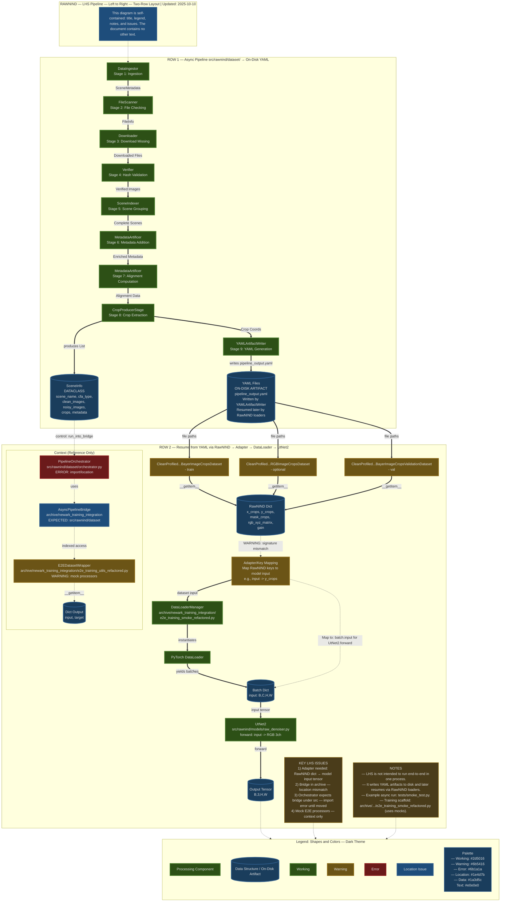

```mermaid
graph TB
    %% ============================================
    %% TITLE (inside diagram)
    %% ============================================
    subgraph TitleBlock["RAWNIND — LHS Pipeline — Left to Right — Two-Row Layout | Updated: 2025-10-10"]
        direction LR
        TitleNote[This diagram is self-contained: title, legend, notes, and issues. The document contains no other text.]
    end

    %% ============================================
    %% LEGEND - Dark theme friendly colors (inside diagram)
    %% ============================================

    %% Styles
    style COMP fill:#2d5016,stroke:#4a7c2c,stroke-width:3px,color:#e0e0e0
    style DATA fill:#1a3d5c,stroke:#2e5c8a,stroke-width:3px,color:#e0e0e0
    style OK_LEG fill:#2d5016,stroke:#4a7c2c,stroke-width:3px,color:#e0e0e0
    style WARN_LEG fill:#6b5416,stroke:#8b6914,stroke-width:3px,color:#e0e0e0
    style ERROR_LEG fill:#6b1a1a,stroke:#8b1a1a,stroke-width:3px,color:#e0e0e0
    style LOCATION_LEG fill:#1e4d7b,stroke:#2e5c8a,stroke-width:3px,color:#e0e0e0
    style Palette fill:#1a3d5c,stroke:#2e5c8a,stroke-width:2px,color:#e0e0e0
    style TitleNote fill:#1e4d7b,stroke:#2e5c8a,stroke-width:2px,color:#e0e0e0

    %% ============================================
    %% ROW 1 — ASYNC PIPELINE (DocScan/rawnind/dataset/) → WRITES TO DISK
    %% ============================================
    subgraph Row1["ROW 1 — Async Pipeline src/rawnind/dataset/ → On-Disk YAML"]
        direction LR
        Ingestor[DataIngestor<br/>Stage 1: Ingestion]
        Scanner[FileScanner<br/>Stage 2: File Checking]
        Downloader[Downloader<br/>Stage 3: Download Missing]
        Verifier[Verifier<br/>Stage 4: Hash Validation]
        Indexer[SceneIndexer<br/>Stage 5: Scene Grouping]
        Enricher[MetadataArtificer<br/>Stage 6: Metadata Addition]
        MetadataArtificer[MetadataArtificer<br/>Stage 7: Alignment Computation]
        Cropper[CropProducerStage<br/>Stage 8: Crop Extraction]
        YAMLWriter[YAMLArtifactWriter<br/>Stage 9: YAML Generation]

        Ingestor ==>|SceneMetadata| Scanner
        Scanner ==>|FileInfo| Downloader
        Downloader ==>|Downloaded Files| Verifier
        Verifier ==>|Verified Images| Indexer
        Indexer ==>|Complete Scenes| Enricher
        Enricher ==>|Enriched Metadata| MetadataArtificer
        MetadataArtificer ==>|Alignment Data| Cropper
        Cropper ==>|Crop Coords| YAMLWriter

        SceneInfoData[(SceneInfo<br/>DATACLASS<br/>scene_name, cfa_type,<br/>clean_images, noisy_images,<br/>crops, metadata)]
        style SceneInfoData fill:#1a3d5c,stroke:#2e5c8a,stroke-width:3px,color:#e0e0e0
        Cropper ==>|produces List| SceneInfoData

        YAMLFiles[(YAML Files<br/>ON-DISK ARTIFACT<br/>pipeline_output.yaml<br/>Written by YAMLArtifactWriter<br/>Resumed later by RawNIND loaders)]
        style YAMLFiles fill:#1a3d5c,stroke:#2e5c8a,stroke-width:3px,color:#e0e0e0
        YAMLWriter ==>|writes pipeline_output.yaml| YAMLFiles
    end

    %% Explicit component styles (working)
    style Ingestor fill:#2d5016,stroke:#4a7c2c,stroke-width:3px,color:#e0e0e0
    style Scanner fill:#2d5016,stroke:#4a7c2c,stroke-width:3px,color:#e0e0e0
    style Downloader fill:#2d5016,stroke:#4a7c2c,stroke-width:3px,color:#e0e0e0
    style Verifier fill:#2d5016,stroke:#4a7c2c,stroke-width:3px,color:#e0e0e0
    style Indexer fill:#2d5016,stroke:#4a7c2c,stroke-width:3px,color:#e0e0e0
    style Enricher fill:#2d5016,stroke:#4a7c2c,stroke-width:3px,color:#e0e0e0
    style MetadataArtificer fill:#2d5016,stroke:#4a7c2c,stroke-width:3px,color:#e0e0e0
    style Cropper fill:#2d5016,stroke:#4a7c2c,stroke-width:3px,color:#e0e0e0
    style YAMLWriter fill:#2d5016,stroke:#4a7c2c,stroke-width:3px,color:#e0e0e0

    %% Layout helpers
    TitleNote -.-> Ingestor

    %% ============================================
    %% ROW 2 — RESUMPTION VIA RAWNIND → DATALOADERS → MODEL
    %% ============================================
    subgraph Row2["ROW 2 — Resume from YAML via RawNIND → Adapter → DataLoader → UtNet2"]
        direction LR
        %% Datasets
        CleanNoisyBayer[CleanProfiled...BayerImageCropsDataset<br/>- train]
        CleanNoisyRGB[CleanProfiled...RGBImageCropsDataset<br/>- optional]
        CleanNoisyVal[CleanProfiled...BayerImageCropsValidationDataset<br/>- val]

        style CleanNoisyBayer fill:#6b5416,stroke:#8b6914,stroke-width:3px,color:#e0e0e0
        style CleanNoisyRGB fill:#6b5416,stroke:#8b6914,stroke-width:3px,color:#e0e0e0
        style CleanNoisyVal fill:#6b5416,stroke:#8b6914,stroke-width:3px,color:#e0e0e0

        %% Connect from Row1 artifact
        YAMLFiles ==>|file paths| CleanNoisyBayer
        YAMLFiles ==>|file paths| CleanNoisyRGB
        YAMLFiles ==>|file paths| CleanNoisyVal

        %% Output signature
        RawNINDOutput[(RawNIND Dict<br/>x_crops, y_crops,<br/>mask_crops, rgb_xyz_matrix,<br/>gain)]
        style RawNINDOutput fill:#1a3d5c,stroke:#2e5c8a,stroke-width:3px,color:#e0e0e0

        CleanNoisyBayer ==>|__getitem__| RawNINDOutput
        CleanNoisyRGB ==>|__getitem__| RawNINDOutput
        CleanNoisyVal ==>|__getitem__| RawNINDOutput

        %% Adapter to model-facing batch
        Adapter[Adapter/Key Mapping<br/>Map RawNIND keys to model input<br/>e.g., input -> y_crops]
        style Adapter fill:#6b5416,stroke:#8b6914,stroke-width:3px,color:#e0e0e0

        RawNINDOutput -.->|WARNING: signature mismatch| Adapter

        %% Dataloaders and model
        DataLoaderMgr[DataLoaderManager<br/>archive/newark_training_integration/<br/>e2e_training_smoke_refactored.py]
        TorchDataLoader[PyTorch DataLoader]
        BatchData[(Batch Dict<br/>input: B,C,H,W)]
        UtNet2Model[UtNet2<br/>src/rawnind/models/raw_denoiser.py<br/>forward: input -> RGB 3ch]
        ModelOutput[(Output Tensor<br/>B,3,H,W)]

        style DataLoaderMgr fill:#2d5016,stroke:#4a7c2c,stroke-width:3px,color:#e0e0e0
        style TorchDataLoader fill:#2d5016,stroke:#4a7c2c,stroke-width:3px,color:#e0e0e0
        style BatchData fill:#1a3d5c,stroke:#2e5c8a,stroke-width:3px,color:#e0e0e0
        style UtNet2Model fill:#2d5016,stroke:#4a7c2c,stroke-width:3px,color:#e0e0e0
        style ModelOutput fill:#1a3d5c,stroke:#2e5c8a,stroke-width:3px,color:#e0e0e0

        Adapter ==>|dataset input| DataLoaderMgr
        DataLoaderMgr ==>|instantiates| TorchDataLoader
        TorchDataLoader ==>|yields batches| BatchData
        BatchData ==>|input tensor| UtNet2Model
        UtNet2Model ==>|forward| ModelOutput

        %% Contextual (kept inside Row 2 for compactness)
        subgraph Context["Context (Reference Only)"]
            direction LR
            Orchestrator[PipelineOrchestrator<br/>src/rawnind/dataset/orchestrator.py<br/>ERROR: import/location]
            Bridge[AsyncPipelineBridge<br/>archive/newark_training_integration<br/>EXPECTED: src/rawnind/dataset]
            E2EWrapper[E2EDatasetWrapper<br/>archive/newark_training_integration/e2e_training_utils_refactored.py<br/>WARNING: mock processors]
            E2EOutput[(Dict Output<br/>input, target)]

            style Orchestrator fill:#6b1a1a,stroke:#8b1a1a,stroke-width:3px,color:#e0e0e0
            style Bridge fill:#1e4d7b,stroke:#2e5c8a,stroke-width:3px,color:#e0e0e0
            style E2EWrapper fill:#6b5416,stroke:#8b6914,stroke-width:3px,color:#e0e0e0
            style E2EOutput fill:#1a3d5c,stroke:#2e5c8a,stroke-width:3px,color:#e0e0e0

            SceneInfoData -.->|control: run_into_bridge| Orchestrator
            Orchestrator -.->|uses| Bridge
            Bridge -.->|indexed access| E2EWrapper
            E2EWrapper -.->|__getitem__| E2EOutput
        end

        %% Inline notes and issues (inside Row 2 to keep two-row layout overall)
        Notes["NOTES\n— LHS is not intended to run end-to-end in one process.\n— It writes YAML artifacts to disk and later resumes via RawNIND loaders.\n— Example async run: tests/smoke_test.py.\n— Training scaffold: archive/.../e2e_training_smoke_refactored.py (uses mocks)."]
        style Notes fill:#4a3c1a,stroke:#8b6914,stroke-width:2px,color:#e0e0e0

        IssueSummary["KEY LHS ISSUES\n1) Adapter needed: RawNIND dict → model input tensor\n2) Bridge in archive — location mismatch\n3) Orchestrator expects bridge under src — import error until moved\n4) Mock E2E processors — context only"]
        style IssueSummary fill:#4a3c1a,stroke:#8b6914,stroke-width:2px,color:#e0e0e0

        Adapter -.->|Map to: batch.input for UtNet2.forward| BatchData
    end

    %% Layout helper to anchor Legend at the bottom
    ModelOutput -.-> Legend
    IssueSummary -.-> Legend
    Notes -.-> Legend

    %% ============================================
    %% LEGEND - Dark theme friendly colors (inside diagram)
    %% ============================================
    subgraph Legend["Legend: Shapes and Colors — Dark Theme"]
        direction TB
        COMP[Processing Component]
        DATA[(Data Structure / On-Disk Artifact)]
        OK_LEG[Working]
        WARN_LEG[Warning]
        ERROR_LEG[Error]
        LOCATION_LEG[Location Issue]
        Palette["Palette\n— Working: #2d5016\n— Warning: #6b5416\n— Error: #6b1a1a\n— Location: #1e4d7b\n— Data: #1a3d5c\nText: #e0e0e0"]
    end
```